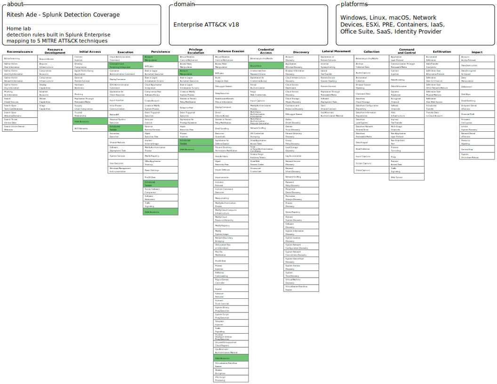
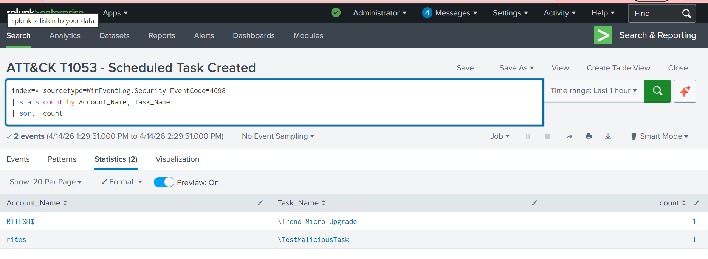
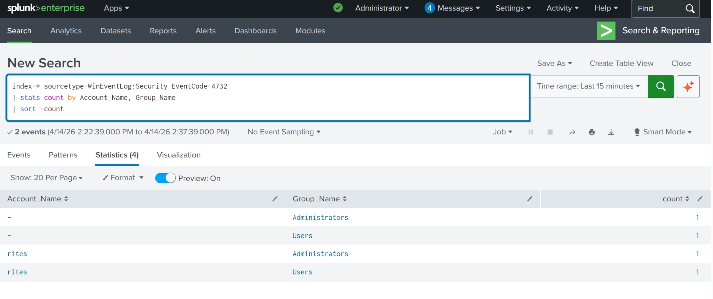

# SIEM Detection Lab — Splunk Enterprise

## Objective
Built a home SIEM lab using Splunk Enterprise to simulate 
real SOC analyst work — ingesting Windows Event Logs, writing 
SPL detection rules, and creating automated alerts for common 
attack patterns.

## Tools Used
- Splunk Enterprise (free licence)
- Splunk Universal Forwarder
- Windows Event Logs (Security, System, Application)
- SPL (Search Processing Language)

## Detection Rules Built

| Alert Name | Event Code | Threat Detected |
|---|---|---|
| Brute Force - Failed Logins Threshold | 4625 | Credential brute force |
| Privilege Escalation - Special Logon Detected | 4672 | Privilege escalation |
| Critical - Account Lockout Risk | 4625 | Account lockout threshold |

## MITRE ATT&CK Coverage
- T1110 — Brute Force
- T1078 — Valid Accounts
- T1548 — Abuse Elevation Control Mechanism

## Screenshots

### SOC Detection Dashboard

### Brute Force Detection

### Privilege Escalation Detection

### Configured Alerts

## Key Skills Demonstrated
- SIEM deployment and configuration
- Windows Event Log ingestion and parsing
- SPL query writing for threat detection
- Alert creation and scheduling
- SOC detection engineering fundamentals

- ## Day 2 — MITRE ATT&CK Detection Coverage

5 detection rules mapped to ATT&CK techniques built in Splunk:

| Technique | ID | EventCode | Severity |
|---|---|---|---|
| Brute Force | T1110 | 4625 | High |
| Valid Accounts | T1078 | 4624+4625 | Critical |
| Command Execution | T1059 | 4688 | Medium |
| Scheduled Task | T1053 | 4698 | High |
| Account Manipulation | T1098 | 4732 | Critical |

### ATT&CK Navigator Coverage Map

### Scheduled Task Detection — T1053

### Account Manipulation Detection — T1098

